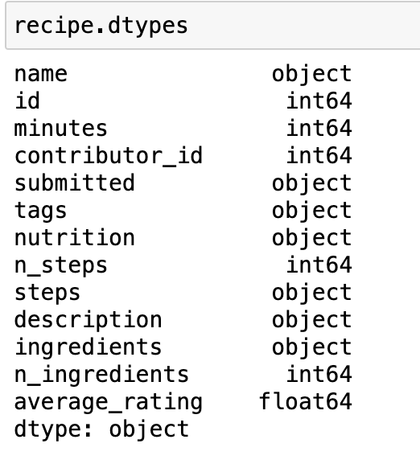

# Recipe Rating Analysis
By Lin Zhou

## Content for this Project
1. introduction
2. Data Cleaning and Exploratory Data Analysis
3. Assessment of Missingness
4. Hypothesis Testing
5. Framing a Prediction Problem
6. Baseline Model
7. Final Model
8. Fairness Analysis


## Introduction
Abundance of diverse recipes and culinary traditions readily accessible to us. This project is set to explore a comprehensive collection of recipes, paired with their corresponding ratings, to identify underlying trends and discern patterns. Our objective is to extract meaningful insights into what drives a recipe's appeal and distinguishes successful culinary creations. We hope to shed light on the elements that resonate with aficionados and casual cooks alike, contributing to a dish's widespread acclaim.

The Datasets we use are 'RAW_recipes.csv' and 'RAW_interactions.csv'. Both of the datasets are sourced from food.com and contains recipes and reviews posted since 2008. 'RAW_recipes.csv' includes information about recipes such as recipe name, ID, minutes(preparation time), contributor_id, submission time, tags, nutrition information, number of steps, text for steps, and description. 'RAW_interactions.csv' contains information about rating such as user ID, recipe ID, date of interaction, rating, and reciew text.

The dataframe for recipes have 83782 rows, meaning 83782 unique recipes. The dataframe for ratings have 731927 rows, each stand for a review on the recipe. For future analysis and research purposes, I merged two dataframes and add column for average rating for each recipes in the merged dataframe.

In the project, we will be first cleaning the data set and conduct exploratory data analysis, to obtain some basic information of the data set and relation between columns. Then, we will assess the missingness contained in the data set by NMAR analysis and analyzing the missingness dependency.

In the missingness analysis, we figure out the missingness of the description, rating, and average rating in the merged dataframe. In the NMAR analysis, we focus on the review column and provide a reasonable description about the missingness of some reviews. In the MCAR and MAR analysis, we implement the dependency test to explore the dependency of the missingness of the rating column in the merged dataframe. More specifically, we test the dependency of the missingness on the number of step and the calories.

Moreover, we would focus on the research question that, are high calories recipes and low calories rated in the same scale. Consider the average recommended daily caloric intake is around 2,500 calories for adults, a recipe that contains more than a certain percentage of this 25% per serving (625 cal) would be defined as high in calories, and less than 25% per serving would be defined as low in calories. We would analyze the rating scale related to the calories of the recipe.

This research question could be important for recipe-designers and food.com website holder. By answering this research question, we could possibly provide the viewpoints to the rating scale for people who use this website. With our result stating whether people would prefer high calories recipes or not, recipe-designers could design higher/lower calories recipes to meet the need to people using the website.

## Data Cleaning and Exploratory Data Analysis

### Data Cleaning 
#### Merging two dataframe
First I follow the instructions and merge the two dataframe. Since there are two dataframe but with common column, which are id and recipe_id. As a result, we merge the two dataframe together to show the recipes and corresponding rating and reviews.

#### Adding average rating column
After merging the two dataframes, we find one important data is the rating for the recipes. As a result, we add new column name ave_rating, which include the average rating for the column. Also, we beleve that the 0 in the rating might be empty rating that people do not fill in. As a result, we replace 0 with nan value

#### Checking Data types
Then, I check the data type for each column and think about the necessary data cleaning steps.


#### Converting `nutrition` column to List and Assign individual Columns
1. I applied `lambda x: eval(x)` on `nutrition` and `tags` columns to convert them from list like string columns into actual list columns.
2. Then I applied `lambda x: x[i]` on the `nutrition` column and assign them to different individual nutritions.

#### Dealing with outlier
I find there are lots of outliers in our dataset. Therefore, I decide to define a function called `outlier` that help me filter out the outliers that is out of the 99th percentile of the dataset. I perform this filter on all the numerical columns and filter all the Nan values caused by this to prevent effect on missingness analysis.
```
def outlier(series):
    percentile_99 = series.quantile(0.99)
    return series[series <= percentile_99]
```

### Exploratory Data Analysis
#### Univariate Analysis
In the univariate analysis, I would analyze the distribution of average rating and the distribution of calories
