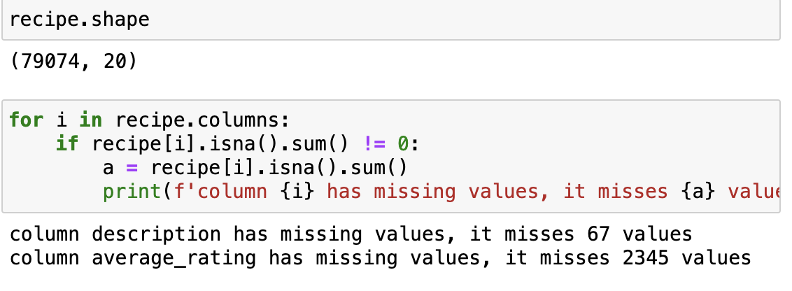

# Recipe Rating Analysis
By Lin Zhou

## Content for this Project
1. introduction
2. Data Cleaning and Exploratory Data Analysis
3. Assessment of Missingness
4. Hypothesis Testing
5. Framing a Prediction Problem
6. Baseline Model
7. Final Model
8. Fairness Analysis


## Introduction
Abundance of diverse recipes and culinary traditions readily accessible to us. This project is set to explore a comprehensive collection of recipes, paired with their corresponding ratings, to identify underlying trends and discern patterns. Our objective is to extract meaningful insights into what drives a recipe's appeal and distinguishes successful culinary creations. We hope to shed light on the elements that resonate with aficionados and casual cooks alike, contributing to a dish's widespread acclaim.

The Datasets we use are 'RAW_recipes.csv' and 'RAW_interactions.csv'. Both of the datasets are sourced from food.com and contains recipes and reviews posted since 2008. 'RAW_recipes.csv' includes information about recipes such as recipe name, ID, minutes(preparation time), contributor_id, submission time, tags, nutrition information, number of steps, text for steps, and description. 'RAW_interactions.csv' contains information about rating such as user ID, recipe ID, date of interaction, rating, and reciew text.

The dataframe for recipes have 83782 rows, meaning 83782 unique recipes. The dataframe for ratings have 731927 rows, each stand for a review on the recipe. For future analysis and research purposes, I merged two dataframes and add column for average rating for each recipes in the merged dataframe.

In the project, we will be first cleaning the data set and conduct exploratory data analysis, to obtain some basic information of the data set and relation between columns. Then, we will assess the missingness contained in the data set by NMAR analysis and analyzing the missingness dependency.

In the missingness analysis, we figure out the missingness of the description, rating, and average rating in the merged dataframe. In the NMAR analysis, we focus on the review column and provide a reasonable description about the missingness of some reviews. In the MCAR and MAR analysis, we implement the dependency test to explore the dependency of the missingness of the rating column in the merged dataframe. More specifically, we test the dependency of the missingness on the number of step and the calories.

Moreover, we would focus on the research question that, are high calories recipes and low calories rated in the same scale. Consider the average recommended daily caloric intake is around 2,500 calories for adults, a recipe that contains more than a certain percentage of this 25% per serving (625 cal) would be defined as high in calories, and less than 25% per serving would be defined as low in calories. We would analyze the rating scale related to the calories of the recipe.

This research question could be important for recipe-designers and food.com website holder. By answering this research question, we could possibly provide the viewpoints to the rating scale for people who use this website. With our result stating whether people would prefer high calories recipes or not, recipe-designers could design higher/lower calories recipes to meet the need to people using the website.

## Data Cleaning and Exploratory Data Analysis

### Data Cleaning 
#### Merging two dataframe
First I follow the instructions and merge the two dataframe. Since there are two dataframe but with common column, which are id and recipe_id. As a result, we merge the two dataframe together to show the recipes and corresponding rating and reviews.

#### Adding average rating column
After merging the two dataframes, we find one important data is the rating for the recipes. As a result, we add new column name ave_rating, which include the average rating for the column. Also, we beleve that the 0 in the rating might be empty rating that people do not fill in. As a result, we replace 0 with nan value

#### Checking Data types
Then, I check the data type for each column and think about the necessary data cleaning steps.


#### Converting `nutrition` column to List and Assign individual Columns
1. I applied `lambda x: eval(x)` on `nutrition` and `tags` columns to convert them from list like string columns into actual list columns.
2. Then I applied `lambda x: x[i]` on the `nutrition` column and assign them to different individual nutritions.

#### Dealing with outlier
I find there are lots of outliers in our dataset. Therefore, I decide to define a function called `outlier` that help me filter out the outliers that is out of the 99th percentile of the dataset. I perform this filter on all the numerical columns and filter all the Nan values caused by this to prevent effect on missingness analysis.
```
def outlier(series):
    percentile_99 = series.quantile(0.99)
    return series[series <= percentile_99]
```
<table border="1" class="dataframe">
  <thead>
    <tr style="text-align: right;">
      <th></th>
      <th>name</th>
      <th>id</th>
      <th>minutes</th>
      <th>contributor_id</th>
      <th>submitted</th>
      <th>tags</th>
      <th>nutrition</th>
      <th>n_steps</th>
      <th>steps</th>
      <th>description</th>
      <th>ingredients</th>
      <th>n_ingredients</th>
      <th>average_rating</th>
      <th>calories</th>
      <th>total fat (PDV)</th>
      <th>sugar (PDV)</th>
      <th>sodium (PDV)</th>
      <th>protein</th>
      <th>saturated fat (PDV)</th>
      <th>carbohydrates (PDV)</th>
    </tr>
  </thead>
  <tbody>
    <tr>
      <th>0</th>
      <td>1 brownies in the world    best ever</td>
      <td>333281</td>
      <td>40.0</td>
      <td>985201</td>
      <td>2008-10-27</td>
      <td>[60-minutes-or-less, time-to-make, course, main-ingredient, preparation, for-large-groups, desserts, lunch, snacks, cookies-and-brownies, chocolate, bar-cookies, brownies, number-of-servings]</td>
      <td>[138.4, 10.0, 50.0, 3.0, 3.0, 19.0, 6.0]</td>
      <td>10.0</td>
      <td>['heat the oven to 350f and arrange the rack in the middle', 'line an 8-by-8-inch glass baking dish with aluminum foil', 'combine chocolate and butter in a medium saucepan and cook over medium-low heat , stirring frequently , until evenly melted', 'remove from heat and let cool to room temperature', 'combine eggs , sugar , cocoa powder , vanilla extract , espresso , and salt in a large bowl and briefly stir until just evenly incorporated', 'add cooled chocolate and mix until uniform in color', 'add flour and stir until just incorporated', 'transfer batter to the prepared baking dish', 'bake until a tester inserted in the center of the brownies comes out clean , about 25 to 30 minutes', 'remove from the oven and cool completely before cutting']</td>
      <td>these are the most; chocolatey, moist, rich, dense, fudgy, delicious brownies that you'll ever make.....sereiously! there's no doubt that these will be your fav brownies ever for you can add things to them or make them plain.....either way they're pure heaven!</td>
      <td>['bittersweet chocolate', 'unsalted butter', 'eggs', 'granulated sugar', 'unsweetened cocoa powder', 'vanilla extract', 'brewed espresso', 'kosher salt', 'all-purpose flour']</td>
      <td>9.0</td>
      <td>4.0</td>
      <td>138.4</td>
      <td>10.0</td>
      <td>50.0</td>
      <td>3.0</td>
      <td>3.0</td>
      <td>19.0</td>
      <td>6.0</td>
    </tr>
    <tr>
      <th>1</th>
      <td>1 in canada chocolate chip cookies</td>
      <td>453467</td>
      <td>45.0</td>
      <td>1848091</td>
      <td>2011-04-11</td>
      <td>[60-minutes-or-less, time-to-make, cuisine, preparation, north-american, for-large-groups, canadian, british-columbian, number-of-servings]</td>
      <td>[595.1, 46.0, 211.0, 22.0, 13.0, 51.0, 26.0]</td>
      <td>12.0</td>
      <td>['pre-heat oven the 350 degrees f', 'in a mixing bowl , sift together the flours and baking powder', 'set aside', 'in another mixing bowl , blend together the sugars , margarine , and salt until light and fluffy', 'add the eggs , water , and vanilla to the margarine / sugar mixture and mix together until well combined', 'add in the flour mixture to the wet ingredients and blend until combined', 'scrape down the sides of the bowl and add the chocolate chips', 'mix until combined', 'scrape down the sides to the bowl again', 'using an ice cream scoop , scoop evenly rounded balls of dough and place of cookie sheet about 1 - 2 inches apart to allow for spreading during baking', 'bake for 10 - 15 minutes or until golden brown on the outside and soft &amp; chewy in the center', 'serve hot and enjoy !']</td>
      <td>this is the recipe that we use at my school cafeteria for chocolate chip cookies. they must be the best chocolate chip cookies i have ever had! if you don't have margarine or don't like it, then just use butter (softened) instead.</td>
      <td>['white sugar', 'brown sugar', 'salt', 'margarine', 'eggs', 'vanilla', 'water', 'all-purpose flour', 'whole wheat flour', 'baking soda', 'chocolate chips']</td>
      <td>11.0</td>
      <td>5.0</td>
      <td>595.1</td>
      <td>46.0</td>
      <td>211.0</td>
      <td>22.0</td>
      <td>13.0</td>
      <td>51.0</td>
      <td>26.0</td>
    </tr>
    <tr>
      <th>2</th>
      <td>412 broccoli casserole</td>
      <td>306168</td>
      <td>40.0</td>
      <td>50969</td>
      <td>2008-05-30</td>
      <td>[60-minutes-or-less, time-to-make, course, main-ingredient, preparation, side-dishes, vegetables, easy, beginner-cook, broccoli]</td>
      <td>[194.8, 20.0, 6.0, 32.0, 22.0, 36.0, 3.0]</td>
      <td>6.0</td>
      <td>['preheat oven to 350 degrees', 'spray a 2 quart baking dish with cooking spray , set aside', 'in a large bowl mix together broccoli , soup , one cup of cheese , garlic powder , pepper , salt , milk , 1 cup of french onions , and soy sauce', 'pour into baking dish , sprinkle remaining cheese over top', 'bake for 25 minutes or until cheese is lightly browned', 'sprinkle with rest of french fried onions and bake until onions are browned and cheese is bubbly , about 10 more minutes']</td>
      <td>since there are already 411 recipes for broccoli casserole posted to "zaar" ,i decided to call this one  #412 broccoli casserole.i don't think there are any like this one in the database. i based this one on the famous "green bean casserole" from campbell's soup. but i think mine is better since i don't like cream of mushroom soup.submitted to "zaar" on may 28th,2008</td>
      <td>['frozen broccoli cuts', 'cream of chicken soup', 'sharp cheddar cheese', 'garlic powder', 'ground black pepper', 'salt', 'milk', 'soy sauce', 'french-fried onions']</td>
      <td>9.0</td>
      <td>5.0</td>
      <td>194.8</td>
      <td>20.0</td>
      <td>6.0</td>
      <td>32.0</td>
      <td>22.0</td>
      <td>36.0</td>
      <td>3.0</td>
    </tr>
    <tr>
      <th>3</th>
      <td>millionaire pound cake</td>
      <td>286009</td>
      <td>120.0</td>
      <td>461724</td>
      <td>2008-02-12</td>
      <td>[time-to-make, course, cuisine, preparation, occasion, north-american, desserts, american, southern-united-states, dinner-party, holiday-event, cakes, dietary, christmas, thanksgiving, low-sodium, low-in-something, taste-mood, sweet, 4-hours-or-less]</td>
      <td>[878.3, 63.0, 326.0, 13.0, 20.0, 123.0, 39.0]</td>
      <td>7.0</td>
      <td>['freheat the oven to 300 degrees', 'grease a 10-inch tube pan with butter , dust the bottom and sides with flour , and set aside', 'in a large mixing bowl , cream the butter and sugar with an electric mixer and add the eggs one at a time , beating after each addition', 'alternately add the flour and milk , stirring till the batter is smooth', 'add the two extracts and stir till well blended', 'scrape the batter into the prepared pan and bake till a cake tester or knife blade inserted in the center comes out clean , about 1 1 / 2 hours', 'cool the cake in the pan on a rack for 5 minutes , then turn it out on the rack to cool completely']</td>
      <td>why a millionaire pound cake?  because it's super rich!  this scrumptious cake is the pride of an elderly belle from jackson, mississippi.  the recipe comes from "the glory of southern cooking" by james villas.</td>
      <td>['butter', 'sugar', 'eggs', 'all-purpose flour', 'whole milk', 'pure vanilla extract', 'almond extract']</td>
      <td>7.0</td>
      <td>5.0</td>
      <td>878.3</td>
      <td>63.0</td>
      <td>326.0</td>
      <td>13.0</td>
      <td>20.0</td>
      <td>123.0</td>
      <td>39.0</td>
    </tr>
    <tr>
      <th>4</th>
      <td>2000 meatloaf</td>
      <td>475785</td>
      <td>90.0</td>
      <td>2202916</td>
      <td>2012-03-06</td>
      <td>[time-to-make, course, main-ingredient, preparation, main-dish, potatoes, vegetables, 4-hours-or-less, meatloaf, simply-potatoes2]</td>
      <td>[267.0, 30.0, 12.0, 12.0, 29.0, 48.0, 2.0]</td>
      <td>17.0</td>
      <td>['pan fry bacon , and set aside on a paper towel to absorb excess grease', 'mince yellow onion , red bell pepper , and add to your mixing bowl', 'chop garlic and set aside', 'put 1tbsp olive oil into a saut pan , along with chopped garlic , teaspoons white pepper and a pinch of kosher salt', 'bring to a medium heat to sweat your garlic', 'preheat oven to 350f', 'coarsely chop your baby spinach add to your heated pan , stir frequently for approximately 5 min to wilt', 'add your spinach to the mixing bowl', 'chop your now cooled bacon , and add it to the mixing bowl', 'add your meatloaf mix to the bowl , with one egg and mix till thoroughly combined', 'add your goat cheese , one egg , 1 / 8 tsp white pepper and 1 / 8 tsp of kosher salt and mix till thoroughly combined', 'transfer to a 9x5 meatloaf pan , and cook for 60 min or until the internal temperature is at least 160f', 'let stand for 5min', 'melt 1tbsp unsalted butter into a frying pan , and cook up to three eggs at a time', 'crack each egg into a separate dish , in order to prevent egg shells from reaching the pan , then add salt and pepper to taste', 'wait until the egg whites are firm looking , but slightly runny on top before flipping your eggs', 'after flipping , wait 10~20 seconds before removing each egg and placing it over your slices of meatloaf']</td>
      <td>ready, set, cook! special edition contest entry: a mediterranean flavor inspired meatloaf dish. featuring: simply potatoes - shredded hash browns, egg, bacon, spinach, red bell pepper, and goat cheese.</td>
      <td>['meatloaf mixture', 'unsmoked bacon', 'goat cheese', 'unsalted butter', 'eggs', 'baby spinach', 'yellow onion', 'red bell pepper', 'simply potatoes shredded hash browns', 'fresh garlic', 'kosher salt', 'white pepper', 'olive oil']</td>
      <td>13.0</td>
      <td>5.0</td>
      <td>267.0</td>
      <td>30.0</td>
      <td>12.0</td>
      <td>12.0</td>
      <td>29.0</td>
      <td>48.0</td>
      <td>2.0</td>
    </tr>
  </tbody>
</table>


### Exploratory Data Analysis
#### Univariate Analysis
In the univariate analysis, I would analyze the distribution of average rating and the distribution of calories
<iframe
  src="pic/EDA_dist_1.html"
  width="800"
  height="600"
  frameborder="0"
></iframe>
The distribution of ratings is left-skewed, meaning there are fewer lower ratings and a higher frequency of higher ratings. This suggests that most recipes have higher average ratings, with 5 being the most common rating.
<iframe
  src="pic/EDA_dist_2.html"
  width="800"
  height="600"
  frameborder="0"
></iframe>
This histogram reveals a distinctively right-skewed distribution, where the majority of recipes feature lower calorie counts and there is a pronounced drop in the frequency of recipes as the calorie count ascends. A vertical line has been added at x=625 to demarcate high from low-calorie recipes, indicating a greater number of recipes falling this threshold.

#### Bivariate Analysis
Then, I do bivariate analysis between the calories and average rating
<iframe
  src="pic/EDA_sca.html"
  width="800"
  height="600"
  frameborder="0"
></iframe>
The graph reveals a predominance of recipes with lower calorie counts, clustered near the y-axis and displaying a diverse range of average ratings from 1 to 5. A significant cluster of recipes rated precisely at 5 suggests a ceiling effect, potentially limiting the rating system's ability to differentiate among top-rated recipes.

#### Interesting Aggregates
In the aggregates analysis, I will study the total protein with average rating.
<iframe
  src="pic/EDA_agg.html"
  width="800"
  height="600"
  frameborder="0"
></iframe>

<table border="1" class="dataframe">
  <thead>
    <tr>
      <th></th>
      <th>average_rating</th>
      <th>mean</th>
      <th>median</th>
    </tr>
    <tr>
      <th></th>
      <th></th>
      <th>protein</th>
      <th>protein</th>
    </tr>
  </thead>
  <tbody>
    <tr>
      <th>0</th>
      <td>1.00</td>
      <td>24.59</td>
      <td>12.0</td>
    </tr>
    <tr>
      <th>1</th>
      <td>1.33</td>
      <td>111.00</td>
      <td>111.0</td>
    </tr>
    <tr>
      <th>2</th>
      <td>1.50</td>
      <td>27.27</td>
      <td>15.0</td>
    </tr>
    <tr>
      <th>3</th>
      <td>1.67</td>
      <td>9.00</td>
      <td>9.0</td>
    </tr>
    <tr>
      <th>4</th>
      <td>1.75</td>
      <td>9.00</td>
      <td>9.0</td>
    </tr>
  </tbody>
</table>

One interesting result that I find in the aggregates data is that for average rating lower than 3.5 most of the recipe tend to have low average and median protein. But for average rating over 3.5, the average and median protein tends to be higher and is fluctuate around 80. This shows higher average rating recipes tend to be health food.


## Assessment of Missingness

### NMAR Analysis
The absence of values in the rating column appears to be Not Missing At Random (NMAR), as observed from the website, where some individuals chose not to provide a rating. Consequently, these instances lack a rating by design, leading to intentional null entries during data collection. To address this, we introduced np.NaN to represent these missing values in the dataset, replacing any zeroes that had been initially used as placeholders. Given that the avg_rating is derived from the rating column, its missing values are considered Missing At Random (MAR), contingent on the presence or absence of data in the rating column. This distinction underscores a systematic pattern in the way missing data arises in avg_rating, directly tied to the anomalies observed in the rating field.
The description column presents an intriguing case for analysis due to the non-obvious nature of its correlation with other columns in the dataset. While it's challenging to directly ascertain its relationship, we hypothesize that the missing values in description are Missing At Random (MAR). In the following section, we will undertake a detailed analysis to substantiate this hypothesis, aiming to clarify the nature of its missingness and any underlying patterns that might influence it.

Our dataset exhibits significant class imbalance, particularly in the context of handling missing values in the average rating column. Directly imputing these missing values with the mean could lead to a reduction in data variance, compromising the integrity of our analysis. Similarly, probabilistic imputation isn't feasible due to the disproportionate prevalence of high average ratings compared to low ones. However, it's important to note that our dataset is substantial in size, containing 79,074 entries, whereas only 2,345 entries are missing average rating data. Given this context, removing rows with missing average ratings is unlikely to substantially impact our future analysis, offering a viable solution to maintain the dataset's robustness without significantly affecting its analytical value.
```
recipe = recipe.dropna(subset=['average_rating'])
```

## Missingness Dependency
First, I will create new column called `is_missing` that evaluate to `True` if description is missing and `False` otherwise.
```
recipe_miss = recipe.copy()
recipe_miss['is_missing'] = recipe_miss['description'].isna()
```
Now, let's assume that the missingness of description is related to two continuous variables: n_ingredients and calories. The hypothesis suggests that recipes with unusually high calorie counts or a large number of ingredients might be more likely to have missing descriptions, potentially indicating a systematic pattern behind the missing data. However, these are preliminary hypotheses that require rigorous testing to confirm or refute. At this stage, we postulate that the missingness of description is unlikely to be influenced by the dataset's discrete variables, focusing our investigation on these continuous factors.

Let's check the KDE graphs of two distributions
<iframe
  src="pic/MAR_Cal.html"
  width="800"
  height="600"
  frameborder="0"
></iframe>

<iframe
  src="pic/MAR_n_ing.html"
  width="800"
  height="600"
  frameborder="0"
></iframe>

Since both of the KDE graph show the similar mean, but for the distribution of n_ingredients, the graph seems to have lots of sharp points. Based on the pattern of the KDE graph, I decide to use K-S Statistics as my test statistics as they share similar means and the KDE graph looks different. I will choose significant level = `0.05`<br>
First let's check calories:
```
observed_ks_cal = ks_2samp(recipe_miss.loc[recipe_miss['is_missing'] == True, 'calories'], recipe_miss.loc[recipe_miss['is_missing'] == False, 'calories']).statistic
```
The observed_ks for calories is `0.1296657943650949`
<iframe
  src="pic/MAR_dist_cal.html"
  width="800"
  height="600"
  frameborder="0"
></iframe>
We got p_value = 0.224 for dependence of calories, Thus we cannot reject the null hypothesis: The missingness of description isn't dependent on calories.<br>
Now we perform the same test for n_ingredients:
```
observed_ks_ing = ks_2samp(recipe_miss.loc[recipe_miss['is_missing'] == True, 'n_ingredients'], recipe_miss.loc[recipe_miss['is_missing'] == False, 'n_ingredients']).statistic
```
The observed_ks for n_ingredients is `0.1671755771864606`
<iframe
  src="pic/MAR_dist_ing.html"
  width="800"
  height="600"
  frameborder="0"
></iframe>

We obtain the p_value is equal to 0.01, thus we reject the null hypothesis: The missingness of description isn't dependent on n_ingredients
Thus, from what the permutation test and the graphs suggests, the missingness of description seems to be related to n_ingredients and seems to not related to calories.

## Hypothesis Testing
The question we are going to research on is that: are high calories recipes and low calories recipes rated in the same scale?<br>
<br>
In this part, I will define a high calories recipe as recipes have more than 625 calories. I will conduct a permutation test.

#### Setting Up the Testing
Null Hypothesis H0: People are rating all the recipes in the same scale.<br>
Alternative Hypothesis H1: People are giving recipes with high calories lower rating<br>
We would select only the useful column, including `calories_no_outlier` and `average_rating`, and also create new column named `high`, which is true if it has calories more than 625 and false if it has calories less or equal to 625.
The reason for choosing one-sided test is that we might assume people who are on diet might rating recipes with low calories higher, and also recipes with high calories are usually unhealthier than ones with low calories.

```
observed_difference = recipe_hypo.groupby('high').mean()[::-1].diff()['average_rating'][-1]
```
Since average_rating is numerical data, and we have a direction for high calories recipes have lower average rating than low calories recipes. Thus, it is proper to use the difference in mean as test statistics. In the part of research, the significant level I choose is 0.05.<br>
The observed difference in mean is `0.007204589773123438`<br>
### Permutation Test
<iframe
  src="pic/hypo_dist.html"
  width="800"
  height="600"
  frameborder="0"
></iframe>
I ran permutation test for 5000 times and the graph shows the distribution of permutation test result. The red line marks the observed value.
### Hypothesis Testing Conclusion
The P-value for the testing is `0.1438`, which means that, under the significant level of 0.05, we fail to reject the null hypothesis.
The result could be reasonable since some high calories recipes might be more delicious than ones with low calories as our body is always seeking for more energy. Besides, taste is highly subjective. Different individuals may have diverse preferences that aren't directly related to calorie content.

## Framing a Prediction Problem
To identify what constitutes a good recipe, I intend to introduce a new column named good_recipe in the dataset. This column will categorize recipes as `good` if they possess an average rating greater than 4.5, and `normal` for those with an average rating of 4.5 or below. This binary classification will facilitate an analysis of the distinctive characteristics that contribute to a recipe's positive reception. Therefore, my prediction problem is a classification problem and it is predicting whether a recipe is good recipe(average rating > 4.5) or normal recipe(average rating $\le$ 4.5).<br>
I've chosen the F1 score as the primary metric to evaluate my model's performance. The F1 score, being the harmonic mean of precision and recall, offers a balanced measure of my model's accuracy in identifying both 'good' and 'normal' recipes. This choice is particularly pertinent given the imbalanced nature of my dataset, which contains a significantly higher number of 'good' recipes compared to 'normal' ones. Relying solely on accuracy could lead to misleading conclusions, as it might inflate the model's performance by capitalizing on the majority class. The F1 score, in contrast, ensures a more nuanced evaluation by equally valuing the model's precision and recall, thereby providing a clearer picture of its predictive capabilities across both categories.

## Baseline Model
**Model Choice**: Random Forest is selected as the baseline model. Random Forest is an ensemble learning method that operates by constructing a multitude of decision trees at training time and outputting the class that is the mode of the classes (classification) or mean prediction (regression) of the individual trees. It is known for its robustness and versatility, being able to handle both regression and classification tasks well.

**Features in the Model**:
**Calories** (Quantitative): This is a numeric feature representing the amount of energy provided by the recipe. It is a quantitative variable as it can take any value within a range and is suitable for regression tasks.
**n_ingredients** (Ordinal): This represents the number of ingredients in a recipe. Although it's numeric and might be considered quantitative, it can also be seen as ordinal since the number of ingredients implies a certain order (e.g., recipes with more ingredients might be considered more complex).

**Feature Encoding**:
In this case, both features used are numeric, and Random Forest can handle numeric features directly without the need for additional encoding.

**Baseline Evaluation**
For the training data, I got F1 score about 0.93 and for the testing data, I got F1 score about 0.70. This indicates the model is overfitting on the train set. I think my current model is not that bad as it achieves a relatively high F1 score. However, since it is overfitting and the F1 score is not perfect, I can not say my model is *good*, it still have lots of space for improvement.

## Final Model
For the final model, I would choose n_ingredients, n_steps, number of tags, all the nutritions(`calories`, `total fat (PDV)`,`sugar (PDV)`, `sodium (PDV)`, `protein`, `saturated fat (PDV)`,`carbohydrates (PDV)`) as features, and I would apply binarize transform on n_steps and n_ingredients. Besides, I would use GridSearchCV to tune my hyperparameters for my RandomForest model.

**Features in the Model**:
**n_steps** (Ordinal, Binarized): This represents the number of steps involved in a recipe. The reason for including and binarizing this feature is that the complexity of a recipe (as approximated by its number of steps) could influence its appeal or suitability for certain users or contexts. Binarizing this feature simplifies the model's interpretation of this complexity into a binary variable (e.g., simple vs. complex), which might be particularly relevant if there's a threshold effect where recipes become significantly more or less appealing once they exceed a certain complexity level.
**n_tags** (Nominal): Tags provide a rich, high-level categorization of recipes (e.g., vegan, quick, holiday-specific). Including the number of tags as a feature could capture the breadth or specificity of a recipe, with the underlying assumption that recipes with more tags might appeal to broader or more specific interests, influencing their popularity or relevance.
**Nutritional Factors** (Quantitative): Each of these—total fat (PDV), sugar (PDV), sodium (PDV), protein, saturated fat (PDV), carbohydrates (PDV)—provides a dimension of nutritional content. Including these factors addresses the increasing consumer interest in nutritional information when selecting recipes. Different nutritional profiles may be more appealing depending on dietary preferences, health considerations, or trends.

#### Relation between Feature selection
**Complexity and Nutritional Awareness**: The rationale for including n_steps (especially binarized) and n_ingredients alongside nutritional information rests on the dual axes of recipe complexity and health-consciousness. In the modern culinary landscape, there's a notable trend towards both simplicity in preparation (reflected by fewer steps and ingredients) and an awareness of nutritional content. Recipes that strike an appealing balance between these factors might be more popular or satisfy specific user needs better, thus potentially improving the model's performance in predicting such outcomes.

**Diversity and Specificity**: The number of tags can reflect the diversity of applications or the specificity of a recipe, suggesting that recipes with a broader appeal (or those catering to niche preferences) can be effectively captured through this feature. This diversity could correlate with the recipe's popularity, user engagement, or suitability for particular purposes.

**Health Trends and Dietary Preferences**: The inclusion of detailed nutritional information directly taps into the growing trend of health-conscious and informed eating. Consumers increasingly base their culinary choices on specific dietary needs or preferences, making these features potentially powerful predictors of a recipe's popularity or relevance to different segments of users.

#### Model Selection:
I still use RandomForest Model as my final model, but I will perform hyperparameter tuning to make it reach its optimal performance on my features.

I performed grid search hyperparameter tuning with the K-fold of 5 and I choose the training range of hyperparameter as following:
```
hyperparameters = {
    'rfc__max_depth': [2, 10, 18, 20, 30, None], 
    'rfc__n_estimators': [50, 100, 150],
    'rfc__min_samples_split': [2, 5, 10],
    'rfc__min_samples_leaf': [1, 2, 4]
}
```
And my best parameters are : `{'rfc__max_depth': 2, 'rfc__min_samples_leaf': 1, 'rfc__min_samples_split': 2, 'rfc__n_estimators': 50}`
And Best Score is `0.817543895179013`

After all the feature engineering and hyperparameter tuning, my final model's performance on train data is: `F1 score = 0.817543895698273`<br>
On test data is: `F1 score = 0.8124922619784574`<br>
It seems that the model performs quite well in practice, not overfitting nor underfitting. And its performance increase about 16% compared to the baseline model and no longer overfitting.

## Fairness Analysis
For this part, I believe my model works well and fair for all population, but let's give it a try. I will test vegan groups to see would it make a difference on f1 score.

Null Hypothesis H0: The classifier's f1 score is the same for population with vegan tags and without vegan tags.
Alternative Hypothesis H1: The classifier's f1 score is higher for population without vegan tags.
Test Statistics: Difference in f1 score.
Significant value = 0.05

First, I define a function for compute F1 score by taking in a dataframe.
```
def compute_f1(x):
    return metrics.f1_score(x['is_high'], x['prediction'])
```
Then I create a new dataframe `results` that has `is_vegan`, `is_high`, and `prediction`
<table border="1" class="dataframe">
  <thead>
    <tr style="text-align: right;">
      <th></th>
      <th>is_high</th>
      <th>is_vegan</th>
      <th>prediction</th>
    </tr>
  </thead>
  <tbody>
    <tr>
      <th>39103</th>
      <td>1</td>
      <td>False</td>
      <td>1</td>
    </tr>
    <tr>
      <th>9758</th>
      <td>0</td>
      <td>False</td>
      <td>1</td>
    </tr>
    <tr>
      <th>41491</th>
      <td>0</td>
      <td>False</td>
      <td>1</td>
    </tr>
    <tr>
      <th>22221</th>
      <td>1</td>
      <td>False</td>
      <td>1</td>
    </tr>
    <tr>
      <th>1068</th>
      <td>1</td>
      <td>False</td>
      <td>1</td>
    </tr>
  </tbody>
</table>

`obs = results.groupby('is_vegan').apply(compute_f1).diff().iloc[-1]` I obtain my observation stats equal to `-0.008526582305602992`

<iframe
  src="pic/fair.html"
  width="800"
  height="600"
  frameborder="0"
></iframe>

I got `p_value_vegan` = 0.194 > 0.05, therefore we fail to reject the null hypothesis. Conclude that our model is still fair for all population.
